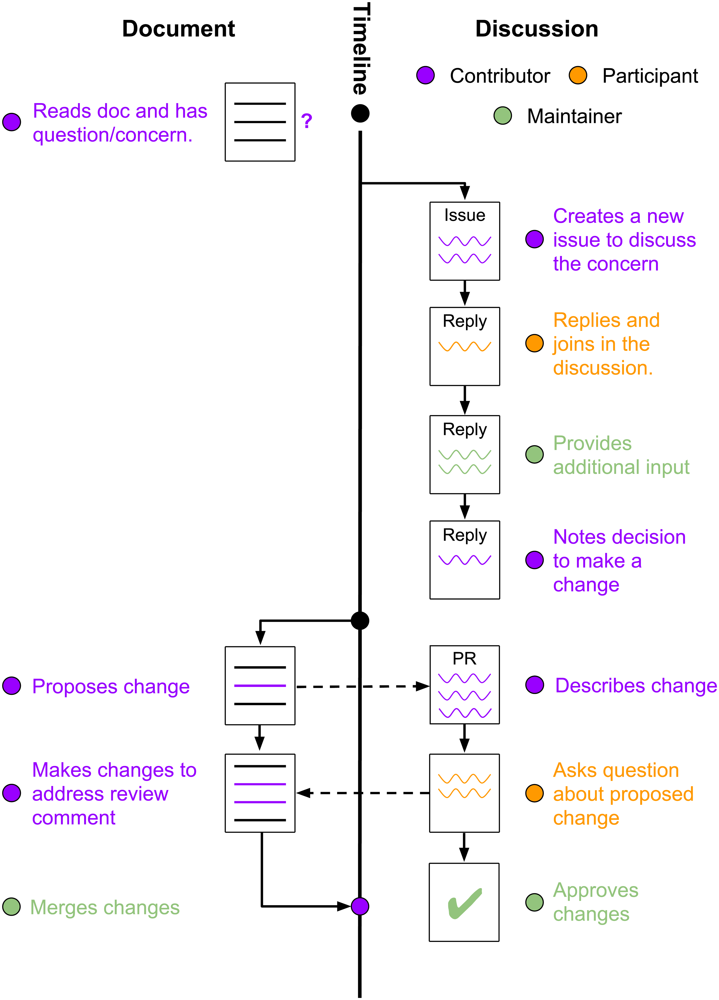

# Open-Source Authoring and Publishing

## Abstract

The contemporary academic publishing model remains trapped in a twentieth-century paradigm defined by static PDFs, opaque peer review, and corporate rent-seeking. This legacy system artificially encloses the intellectual commons, restricts participation to institutionally affiliated researchers, and produces machine-hostile outputs that hinder both reproducibility and AI-driven scientific discovery. Drawing on the proven methodologies of open-source software development, this paper proposes a complete architectural and socio-economic overhaul of scholarly communication. We introduce a continuous, Git-native authoring and publishing workflow supported by a unified toolchain (OSAP) and an open, community-governed registry. By treating research artifacts as version-controlled, executable repositories, the proposed paradigm enables transparent attribution via commit histories, automated continuous integration for validation, and post-publication peer review through collaborative issue tracking. We further detail mechanism designs to mitigate systemic risks such as citation cartels and Sybil attacks, shifting academic prestige from performative metrics to verifiable labor and functional dependencies. Economically, this model dismantles the multi-billion-dollar extraction of publicly funded research, replacing it with a low-cost, egalitarian infrastructure that aligns the social relations of academia with its digital productive forces. This paper outlines the economic arguments, technical architecture, quality control protocols, and transition pathways required to restore science as an open, continuous, and universally accessible public utility.

## Introduction

The media and methods of information are tightly related to the pace of human progress. The arrival of computer technology, the internet, and large language models have deeply revolutionized the way that humans create and share knowledge. While nowadays academic publications, or intellectual commons in general, that are meant to be disseminated for public good, are largely trapped inside an outdated, printing-centered, and exclusive enclosure that hinders participation and sharing.

In the traditional model, the authoring process is opaque; the publishing is oligopolistic; and after publishing, the access is plutocratic. As a catalyst, the training of large language models needs a huge amount of machine-readable data from the public domain. [The privileged access and outdated binary data (PDF) have created large barriers for those models to perform well in research tasks](@doi:10.1145/3768156,@doi:10.3389/frai.2026.1781692,@doi:10.17159/sajs.2025/23053).

Open-source software has thrived since the end of the 20th century due to its freedom of access, participation, and divergence, which is also the major driving force of the advancement in information technology and the resulting [economic booming](@doi:10.2139/ssrn.4693148). The methodologies involved in the open-source development lifecycle, including source repositories, version control, continuous integration, issues, and pull requests, are valuable practices to be integrated into the future of academic writing.

The ossified authoring and publishing model must be completely discarded in favor of a more egalitarian and digital-native approach, where everyone can freely access, contribute, attest, and attribute to the intellectual commons. This document will assess the limitations in the traditional model, elaborate on the new system, and envision the socio-economic impact of the new authoring and publishing.

## Status Quo

### Exclusive Participation

In traditional journals, manuscripts are sent to submission systems, which often require ORCID and [institutional affiliation](@id:nature_publishing_policies_affiliation,@id:elsevier_nutrition_authors_guide), which creates a barrier for people with no institutional background. Even if the submission succeeds, desk rejection will almost certainly happen on the works with unauthoritative or unverifiable author identities. Moreover, assuming even desk rejection does not happen, in the peer review phase, single-blind reviewers often have a bias toward manuscript authors with a low profile. With all the aforesaid factors combined, academic publishing has been essentially restricted to researchers inside universities and famous laboratories.

### Plutocratic Access

Once a manuscript is accepted for publication, old-school journals often require [transfer of copyright or exclusive publishing rights](@id:nature_publishing_policies_publishing_right,@id:cell_trends_editorial_policies). These protocols directly infringe upon the principle that academic results are meant to be the shared knowledge for human progress, instead of properties of proprietary companies. To allow free access for all, researchers are often required to pay a large amount of Article Processing Charges (APC) themselves. This creates another layer of inequality that only researchers with wealthy backgrounds or abundant funding can overcome to allow their own works to be accessible to other researchers.

If APCs are not paid, the academic works will be locked behind a paywall of subscription fees, which reinforces [the barriers to access for common citizens or underfunded researchers](@id:aaronson2007review). Economically, APCs are not making the scientific publication process more affordable. [It simply transfers the profit of publishers from subscription fees to direct exploitation of researchers](@doi:10.1162/qss_a_00272,@doi:10.3138/jsp-2022-0073), who are still funded by the state and are indirectly extracted from the taxpayers.

Researchers and libraries that subscribe to journals are often nationally funded by the government. [The research and peer review works are largely free labor where researchers spend time and equipment on research without receiving profit](@doi:10.1177/1350508412448858). While journals are still charging high APC and subscription fees to readers. A unidirectional chain of value flow has formed, where journal publishers directly or indirectly exploit taxpayers, researchers, and government workers for private profits with [high profit margins](@id:relx_2025_financial_review,@id:springer_nature_2025_annual_report), as well as creating negative societal externalities that hinder the access of academic resources from citizens and researchers to comprehend the latest advancements.

> **Figure 1**: How money flows to publishers

We argue that journal impact factors and the consequent market performance are orthogonal to publishing service quality. Citations are generated by perceived scholarly rigor, which is determined exclusively by author and reviewer labor. Publishing services function as transmission media that do not transform epistemic quality. Since the impact factor is a function of citations alone, it carries no information about service quality. The observed correlation between high impact factor / high profit journals and rigorous papers is therefore entirely attributable to selection effects: talented authors submit to high impact factor venues because of existing prestige, not because those venues produce rigor. Consequently, the profits from the prestige economy, proportional to the impact factor, represent systematic misattribution from laborers to intermediaries.

### Opaque Authoring

The only way that authorship is entitled to an academic paper is via the authors' list under the headline. This list fails to identify the individual contributions of the authors and does not provide a method of provenance. And in practice, [authorship coercion happens from time to time among research papers](@doi:10.1371/journal.pone.0280018,@doi:10.1371/journal.pone.0187394). The lack of granular responsibility makes large-scale academic misconduct and the free rider problem undetectable, which harms academic fairness.

### Obsolete Medium

The majority of academic works are still published in the format of PDF, which is designed for human reading and printing. Researchers cannot embed interactive media and charts, executable research code, nor the dataset involved in research projects. This absence of supporting material in research papers makes them irreproducible and experiment result fabrication becomes possible. This format also lacks the interactivity and interoperability presented in modern web-based presentation formats, making the work less comprehensible to people outside of the research world.

With the recent development of large language models, machine-readable training data in the public domain is in demand more than ever. However, due to the private ownership of journal publishers over research papers, and the nature of PDF, which is less digestible by machines than plain text formats, an obstacle is formed between LLM participation and professional research fields. Research has proven that a [large amount of open data will hugely improve the capability of LLMs in the corresponding field](@doi:10.48550/arXiv.2001.08361); the inaccessibility of closed formats may cause long-term insufficiency in LLM participation in research works, potentially slowing down the pace of academic progress.

### Dilapidated Mode of Production

Just as the steam engine and the printing press shattered the guild systems in the feudal era, the internet and open-source infrastructure [have radically transformed how we produce and share knowledge](@id:nielsen2020reinventing), and rendered the physical and economic constraints of the 20th-century academic journal obsolete. [The current mode of academic publishing relies on artificial scarcity](@id:fitzpatrick2011planned,@doi:10.1186/s41073-026-00193-3,@doi:10.5465/amj.2023.4006,@doi:10.3138/jsp.49.1.26,@id:young2008current,@doi:10.2139/ssrn.6300605). By locking research behind paywalls and relying on centralized gatekeepers to confer prestige, the traditional journal acts as a fetter. It restricts the flow of the very productive forces (digital data) it is supposed to manage, creating an enclosure of the digital commons. [The material productive forces of society come into conflict with the existing relations of production](@id:marx1904critique). Consequently, a transition toward a decentralized, democratized publishing mode is not merely a technological upgrade, but a necessary historical resolution to align the social relations of academia with the realities of its digital productive forces.

## Prior Art

The history of academic publishing can be traced back to post-Renaissance Europe. [Journals existed but remained primarily non-profit; they pursued knowledge circulation instead of academic prestige](@doi:10.5281/zenodo.546100). A transnational intellectual community, “Res Publica Literaria” (the republic of letters), played the key role in the dissemination of academic knowledge. It remained the apparent openness through its existence. However, due to the contemporary low literacy, the academic community remained an aristocracy in the learned society.

After World War II, with the rapid growth of academic activity, [the academic publishing sector began commercialization and professionalization; peer review, originally a voluntary practice, was adopted commercially as a “value-added” service](@doi:10.5281/zenodo.546100), while the drafting and reviewing process was still largely performed by voluntary researchers, forming a systemic exploitation.

After the arrival of the digital era, the pace of the oligopoly did not retreat, but accelerated. [The Oligopoly of Academic Publishers in the Digital Era](@doi:10.1371/journal.pone.0127502) systematically analysed the tendency of oligopoly in the modern academic publishing industry, and revealed key discoveries that the value added by the quality control process is not done by the publishers, and the tension that researchers are still structurally suppressed to publish in prestigious journals to gain tenure and grants.

[The future of the quality assurance system: its impact on the social and professional recognition of scientists in the era of electronic publishing](@doi:10.1177/016555159702300605) discusses the potential transition of the journal system in the electronic age. It ends with the conclusion that the transition will be majorly technological, and the legacy journal system will remain. However, the research ignored the fundamental reshaping of digital technology in the way of information circulation and knowledge production (the productive forces), which necessitates a complete revolution in the publication system.

[Deep impact: unintended consequences of journal rank](@doi:10.3389/fnhum.2013.00291) rigorously assessed the current limitations of using journal ranking indices as the primary metric of paper quality, and pointed out that corporate publishers use journal rank rhetoric to keep their journals closed-access and increase subscription prices. This paper also proposes an open, fair, and interoperable scientific evaluation option to replace the journal rank system using modern information technology. Yet, due to the shift of focus, it doesn’t provide a clear outline of the new system.

The Open Access Movement and [The Cost of Knowledge](http://thecostofknowledge.com/) were two prominent movements trying to break the imprisonment of the publishing system. However, the Open Access Movement only covers a small portion of articles, with the cost of APC solely borne by researchers. The Cost of Knowledge successfully catalyzed long-term institutional boycotts and raised awareness, they operated primarily as protests rather than providing a tangible, sustainable technical infrastructure to replace the oligopoly.

[Several other discussions and attempts existed](@doi:10.1038/nature.2013.12243,@doi:10.3389/fncom.2011.00055,@doi:10.3389/fncom.2012.00011,@doi:10.3389/fncom.2012.00031,@doi:10.3389/fncom.2012.00063,@doi:10.3138/jsp-2022-0073,@id:padula2017democratizing), including full open access journals, network-based evaluation, post-publication peer review, and publishing as an online service. Some of them proposed a tangible new publishing model and outlined clear paths toward it.

Around the year 2020, Web3 and blockchain technology gained prevalence. [A lot of research has been done that explores the possibility of using blockchain technology to democratize scholarly publishing](@doi:10.1109/TCSS.2022.3204745,@doi:10.24251/HICSS.2019.560,@doi:10.3389/fbloc.2019.00019,@doi:10.3389/fbloc.2024.1375763,@doi:10.1016/j.ipm.2021.102724,@doi:10.1109/BLOC.2019.8751379,@doi:10.3390/publications7020033,@doi:10.1109/TSMC.2023.3266223). However, academic publishing systems built on blockchains are fundamentally infeasible and flawed, breaking the core values of constraints of blockchain. The core tension can be summarized as follows:

- blockchain cannot verify reviewer expertise without centralized identity oracles, breaking decentralization
- game theory dictates that non-financial reputation lacks whistleblower incentives, while tokenized incentives invite spam and a [whole range of financialization risks](@doi:10.3389/fbloc.2025.1641294)
- decentralized [storage at a large scale is immature and expensive](@doi:10.1038/s41597-025-06335-4)
- [the adoption of blockchain technology is slow, and onboarding requires a high-level understanding of blockchain technology](@doi:10.3389/fbloc.2025.1641294)

At the technical side, [Learning from open source software projects to improve scientific review](@doi:10.3389/fncom.2012.00018) discussed how to incorporate code review in open-source software development into academic review. [Git can facilitate greater reproducibility and increased transparency in science](@doi:10.1186/1751-0473-8-7) elaborated the way that Git can streamline the asynchronous collaborative editing workflow. [Two other articles](@doi:10.48550/arXiv.2408.09344,@doi:10.1111/2041-210X.14108) proposed and outlined the use of Git hosting services, especially GitHub, in scientific authoring. While [more papers and articles](@doi:10.3390/psych3040053,@doi:10.3758/s13428-020-01436-x,@doi:f1000research.20843.1,@doi:10.3233/DS-210031,@id:gandrud2018reproducible) explored how software engineering techniques in the R language can facilitate the reproducibility in research papers.

The most significant advancement in the reform of academic authoring and publishing is [Manubot](@doi:10.1371/journal.pcbi.1007128,@doi:himmelstein2019manubot), which is an eloquent proposal with a working open-source software. It covers open-source authoring with Git, collaboration with GitHub, and various technical details, including continuous integration, PDF and HTML parsing, and automatic citation resolution. While it doesn’t cover the publishing process and the socio-economic arguments in detail, this paper still derives substantial inspiration from the technical side of Manubot.

However, most research papers mentioned above stayed within the legacy journal system and only discussed several aspects of the new paradigm. Most papers remained conceptual without a feasible real-world implementation.

## The New Paradigm

### Git Repositories and Authoring

The medium of the new manuscript drafting will be Git Repositories hosted on Git hosting services like GitHub and GitLab. Authors draft papers by making commits or pull requests. Instead of opaque document drafting, open-source authoring, or development in general, often follows the collaboration workflow as follows:

1. The initiator, often one of the authors, creates a local Git repository.
2. He or she also creates a remote repository in Git hosting services as a shared source of truth and links it to the local repository. Then an initial commit is made to populate the remote repository with the basic setup.
3. Other authors or contributors can obtain a copy of the repository by creating a fork or cloning the repository.
4. Then, the authors conduct research, record data in files, and draft their part of the paper. They frequently commit or create pull requests to the main branch to save their work.
5. All commits and pull requests are checked by continuous integration pipelines hosted by Git hosting services (e.g., GitHub Actions) to ensure the quality of text and code and the validity of citations.
6. Authors also frequently sync their local repository to make their local copy aligned with the remote.
7. When the work is finished. An automated pipeline will bundle the main paper into HTML and PDF formats with other repository files. Then it will automatically mint a DOI, upload the PDF to public archives, and deploy the website with the full content and metadata. This will be covered in detail in [[#Versioning and Publishing]].
8. When later changes are made, and authors meet agreement, a new version of the paper can be released independently from the previous releases.

> **Figure 2**: Collaborative Editing Workflow  
> Source: reprinted from [Open collaborative writing with Manubot](@doi:10.1371/journal.pcbi.1007128)

By hosting the paper authoring in a public Git repository, the activity of the authoring process becomes fully transparent. Anyone with an eligible account of the Git hosting service can view the editing history directly via the service’s web interface. This provides the most accurate insights into the contribution of each author (git blame), which eliminates ambiguities between individuals in terms of attribution and copyright. By analysing the Git history using professional tools, potential plagiarism and authorship coercion could be detected and flagged.

The Git paper authoring lifecycle also facilitates free collaboration, participation, and access of the writing process and content of the work. In the modern open-source software development lifecycle, common users can report bugs via issues, they can contribute to the development process themselves by forking the repository and create their own pull requests. Some Git hosting services, like GitHub, also provide discussions to ask questions or discuss about implementations. The open-source authoring process can be opt-in these integrated features. People with constructive ideas but zero institutional ideas can also create their own pull requests in writing the paper and add themselves to the authors list. Moreover, with this liberated infrastructure, everyone will be able to publish or access an academic work publicly, regardless of economic or institutional background.

With development pipelines like continuous integration and version control capability via Git, the quality control and publishing process will be highly automated, and the publications will be more error-tolerant and up to date. Basic continuous integration can automatically check for formatting, spelling, and citation issues when a pull request is launched. While the versioning function allows an open-source publication to release a new version after being identified with several methodological flaws in the previous version.

### Renovated Representation

When researchers use an entire repository as the base for their research, the possibility of the representation of the research process and result can be extended to everything that can be achieved by modern computer technology.

The final artifact of a research project will no longer be a PDF, but all kinds of file formats are possible. Inside a repository, there can be raw datasets, periodic investigation logs, photos, code, and all other formats that make the research more authentic and persuasive. To push it further, a research paper can be drafted in conjunction with the real implementation. For example, the repository contains the source code of a real open-source software, and a research paper is written in conjunction to illustrate the novelty of the algorithm used in the software.

The content of the open-source authored research will center around machine-readable formats, such as Markdown or Jupyter Notebook for text content, CSV for datasets, and raw source code for programs. Meanwhile, researchers should ensure that:

> All experiment conclusions and calculated results, together with how they are produced (manual process or code), should be either cited from authentic sources or committed to the repository as files to ensure reproducibility.

This requirement, together with machine-readable formats, not only makes the research described in the paper reproducible but also makes AI agents navigate better inside a research repository, accelerating the research process. The entire repository, which contains the full paper content and all the data, will become public AI training data that helps the advancement of LLM intelligence.

The research repository can also adopt some other open-source development approaches, such as a monorepo. Hundreds of researchers can work collaboratively in a single repository containing tens or hundreds of individual but tightly related research projects. This ensures the instant sharing of the newest findings and real-time collaboration between researchers.

### The Unified Toolchain

Inspired by software development, open-source authoring and publishing deserve various tools (DevOps) to automate routines. While several tools exist (Manubot and several R packages mentioned in [[#Prior Art]]), none have successfully streamlined the processes for the entire workflow or for non-technical researchers. A successful tool should be usable in both continuous integration pipelines and researchers’ daily operations, and should be extensible to suit various workflows.

We propose a unified toolchain for open-source research - the computer program `osap`, which stands for open-source authoring and publishing. This open-source tool will be built in a modular style with both command line interface and graphic user interface, each module will wrap around existing tools such as Manubot and Git for swift development and compatibility.

`osap` core will be only a module loader and inter-process communication layer, while modules serve for distinct purposes. Modules are developed in bare programmatic APIs, and the CLI and GUI are simply another layer of abstraction above these APIs.

While extensible via modules, `osap` should primarily serve for the following purposes:

- provides a simplified Git interface for non-technical researchers
- provides basic file formatting and spell check for continuous integration
- provides citation management and automatic retrieval
- provides a static site generator and PDF renderer for parsing the raw paper to established formats
- provides a publishing pipeline that integrates into the legacy system

Inspired by declarative package managers, the behavior of `osap` can be configured by `meta.yaml` inside the repository. This file configures the default `osap` behavior and determines the metadata of the published paper, which is essential when integrating into the existing system.

### Versioning and Publishing

The versioning of research projects guarantees the immutability and reliability of research artifacts. And a well-architected publishing workflow can make the research artifact compatible within the current system.

> **Figure 3**: How A Paper Becomes Recognized

Research projects need to specify an entry in `meta.yaml` pointing to a text file that serves as the major content of the generated PDF file and the main page of the website.

During publishing, an automated workflow will auto-discover pages related to the main entry according to the `meta.yaml` configuration, resolve citations by looking up resource metadata from online metadata database and websites, and finally bundle the pages into a single PDF file. The PDF parser should generate the info dictionary in PDF files, including paper, author, and citation information for the PDF parser to resolve the paper. The PDF, together with the automatically created repository snapshot, will be listed in the assets page in Git hosting services.

Then the paper will be uploaded to [Zenodo](https://zenodo.org/). During the upload, all resources that are cited by the paper must be submitted in the metadata for proper attribution. Zenodo will mint a DOI for the uploaded artifact, which is then used in the website building.

Similar to the PDF parsing, the files for a website will be built by the automated pipeline from the interactive media inside the repository, with the entry specified in `meta.yaml` as the homepage of the website. The website builder should:

- automatically convert files such as Jupyter Notebook, markdown, and LaTeX into HTML pages
- follow the best practices in search engine optimization
- fill the HTML `<meta>` tags, such as `citation_title` and `citation_author`, on the home page for discoverability.

Then the website will be hosted in services like GitHub pages or researcher-controlled servers and submitted for search engine indexing. This ensures Google Scholar can regard the website as a valid research paper.

This pipeline will be performed on each version of the publication. Each version will have a distinct DOI, and the website will allocate distinct pages for different versions of the page. The publications should be released under the Creative Commons license, such as CC BY 4.0 or CC BY-SA 4.0, to facilitate open access.

### The Open Registry

The authoring and publishing approach described above (Git authoring + Zenodo publishing + `osap` tooling) is already highly feasible and practical for independent publishing. While Zenodo provides an immediate bootstrap mechanism, a dedicated, domain-aware registry is required to unify quality control, attribution, and discovery at scale.

Thus, we propose the OSAP publication registry to be established, which replaces the role of Zenodo in the current solution described above. It will act as a trusted proxy and quality filter between the legacy publishing system and the new paradigm.

Akin to the concept of package registries in software development, the OSAP registry will be a place for open-source authors to freely publish their works. It will serve for the following purposes:

- provides a specialized registry for open-source publications, with DOI minting and citation resolution for publications. DOI minting will be facilitated through institutional DataCite membership, with costs absorbed by the registry's operational budget.
- provides a user-friendly interface to query the published artifacts and their apparent statistics (e.g., GitHub stars, duplication, citation counts, download counts).
- provides a public-facing and authoritative website for publication discoverability in search engine queries and facilitates reading by common citizens.
- performs advanced quality screening by using neural network citation graph analysis, duplication check, Git history analysis, and provides a venue for post-publication open peer review.
- collaborate with DOI issuers and citation indexers (Web of Science, OpenAlex) to punish misconduct.

By maintaining the registry, open-source researchers will have a shared server and community for their research works. The quality control process will also keep the new publication workflow academic and reputable.

## Socio-Economic Vision

### Post-Publication Peer Review and Attribution

In the traditional model, the publication of a scholarly paper requires a complex routine, which usually involves submission, desk rejection and peer review. Often a few reviewers are involved in the process of an individual paper, the reviewers also operate with little incentive and relevance. This process is prone to [overlook or discriminate potential in reviewed manuscripts](@id:akst2010hate); and the entire review and revision process could take months to finish, which hinders the fast evolution of the academia.

In open-source publishing, there’s no formal peer review phase before the publication of a paper. This ensures the fast iteration of the release cycles as well as gathering early feedback. [The acceleration of the spread of information will eventually lead to faster academic progress](@doi:10.1007/978-3-642-37186-8_1,@doi:10.1126/science.289.5477.259).

The review function is primarily absorbed by post-publication review and crowd reputation. Due to the open nature of open-source authoring, anyone with a Git hosting service account can open an issue in the repository to attest to the format, methodology, and validity of the results. Researchers can revise their artifact and re-publish in a new version. This ensures the content of the research will constantly evolve for the better. Higher activity of issue and discussion signals higher impact.

### Quality Control

A decentralized, open registry is vulnerable to Sybil attacks and citation cartels, where people can mass-produce low-quality papers that cite existing papers to boost their citation power. And according to Goodhart’s Law, the metric-based quality evaluation makes it possible for malicious authors to game the metric, making it ineffective.

However, an open-source authoring and publishing workflow has advantages when combating this situation. Traditional citation graph databases like Web of Science are opaque and proprietary; only a single company is responsible for maintaining the graph hygiene. The new paradigm features transparent Git contribution history and an open registry; anyone can perform graph analysis and Git history provenance independently and submit spam papers for review.

To mitigate the risk of spam publications, the OSAP registry could have a revocation mechanism: publications submitted to the registry will immediately be published and obtain a DOI. However, once the paper is recorded in the registry, it will receive constant public review as well as organized provenance analysis, which includes metadata validation, Git history analysis, citation network analysis, algorithmic / AI-driven pre-screening, whistleblowing mechanism, and post-publication prestige peer review.

The most basic metadata validation includes querying ORCID to ensure the authors exist. Validate required metadata fields are present and the values are within sane ranges.

The publications registered on OSAP will be majorly works drafted via open-source authoring. The public Git repositories linked by the publications will be publicly accessible and analysable via algorithms. The OSAP registry will perform a algorithmic scan focusing on commit histories and generate Proof of Authorship for every author that have performed substantial contribution. Then the algorithm will compare the history with the author list to prevent author coercion.

The next quality screening will be citation network analysis. The citation integrity verification will be performed first. Then, following the network analysis. Inspired by how search engines detect backlink farms, an analysis of network citations after publishing can identify common patterns shared by citation cartels.

However, the Git history can be amended programmatically, and the citation network can be manipulated. So the next step is on the content of the publication. Including a duplication scan that will take place to detect academic plagiarism, and a prompt injection scan that identifies machine-hostile spam. Then LLMs will be used to identify the misconduct inside the publication content, including repetition of prose, content that is irrelevant to the topic, and obviously nonsensical / inflammatory statements. The AI scan should avoid subjective value judgements.

After the pre-screens above, the submission will be published, and a DOI will be assigned.

After publishing, the artifacts still face constant community review. The whistleblowing mechanism enables everyone to report misconduct in publications. Community review will be carried out, and those flagged by a large portion of reviewers will be regarded as misconduct and removed from the registry. The corresponding DOI content will be updated to be a placeholder that signifies policy violation. And the registry will notify citation indexers to remove the publication from their citation graph.

The registry will have a reviewer prestige system, their prestige system defines what weight they carry in the post-publication review process, which is calculated as a weighted, log-scaled function of the performance of their publications and review activities. The performance of each publication is calculated from apparent statistics such as citations, GitHub / GitLab stars and the activity of issues and discussions. The prestige system is designed to prevent Sybil attacks that malicious figures could automate account registration and spam review. The post-publication peer review mechanism can be carried out in various forms, including issues in Git hosting services and social discussions, it will achieve the quality assessment function in tradition journals but is fully transparent and carried out at larger scale.

### Egalitarian Participation

Since every legitimate human with an internet connection and an email address can register for a Git hosting service and an ORCID account, the publication and access of open-source authoring and publishing are open to everyone.

By democratizing participation and diversifying representation, the new paradigm would demystify the process of academic advancements. Anyone, including industry engineers, independent researchers, or even autonomous AI agents, can publish the advancements in their fields or share public data in any machine-readable format, as well as download and examine others’ research artifacts. The equality and universality of access to academic research could allow more diversified opinions to be heard in academia, [more innovative ideas to be discovered](@doi:10.2139/ssrn.5750822,@doi:10.1021/jacs.0c07877), and a smaller information gap brought by economic inability or institutional bias.

### End of Rent Seeking

As deduced in [[#Plutocratic Access]], journal publishers often extract unjustifiable revenue via methods like APC charges and subscription fees, while enjoying the free labor of researchers and reviewers as well as the prestige economy brought by the impact factor. Below will be a detailed analysis of the societal costs related to academic publishing compared with the proposed new paradigm.

The global revenue in academic publishing ($R_{pub}$) [is estimated to be $19 billion annually](@url:https://wordsrated.com/academic-publishers-statistics/). The direct financial savings of transitioning to the OSAP paradigm are modeled as the difference between current proprietary publisher revenues and the operational expense of global OSAP infrastructure ($C_{OSAP}$). Because the proprietary model relies entirely on the uncompensated labor of authors, reviewers, and academic editors for its core value creation, the publisher’s actual technological and administrative overhead is minimal. Additionally, the crowd-sourced, digitized, and highly automated OSAP registry eliminates most of the administrative or material costs involved in academic publishing.

By benchmarking against the expenses of arXiv, which were [$4.814 million in the 2024 financial year](@id:arxiv2024annual), an upper bound for $C_{OSAP}$ could be established at around $10-30 million​ annually, scaling with usage but remaining orders of magnitude below current $R_{pub}$. Consequently, the estimated societal cost, as well as the reduction in deadweight loss when adapting OSAP globally, is estimated at $19 billion. Due to the fact that a large portion of the revenues originates from state-funded researchers. The spare value could be used by the state for other public welfare.

The model above only covers the direct extraction of academic publishers. However, the obsolete model of academic publishing has also brought other profound and transient social costs, including but not limited to:

- the societal value lost during the delay in the submission, desk rejection, and peer review stages
- the lost utility for citizens, policymakers, and industry engineers who cannot access publications due to paywalls
- the deficit in AI model academic capability due to the inability to train on copyrighted content
- the lost societal value of innovations generated by independent or underfunded researchers who are desk-rejected or discouraged from submitting due to institutional bias or economic burden
- the cost of dead-end research pursued because of methodological flaws or negative data were suppressed by [publication bias toward novel and positive results](@doi:10.1177/1745691612464056)
- the macro-economic cost of brilliant scientific minds spending time navigating the prestige economy instead of doing actual research

The transient costs listed above are hard to measure quantitatively. However, the aggregate total cost might exceed trillions due to systemic inequality and the obstruction to global scientific advancement.

Journals could gradually transform from hard oligopolies to soft certification services. Since academic publications no longer need to pass through journals, yet their prestige could still remain for a long period. Journals could evolve to a new business model where researchers can pay journals for assessment, journals review the publications, and grant certificates for qualified works as a prestigious proof of the academic rigor of the publication.

## Limitations and Mitigation

### Technical Hurdle

The use of Git and a package manager inspired the OSAP registry requires professional software development skills. The vast majority of researchers are incapable in the domain of software development. The prevalence of OSAP might be limited in a technical cohort.

To mitigate, the `osap` computer program should be implemented with a dedicated graphical user interface version, with simplified abstractions on Git and registry-related workflows.

### Transitional Inertia

The world’s most recognized research citation indexer, Web of Science, only indexes prestigious journal articles; artifacts published via OSAP are excluded. Universities and laboratories may still see publishing in high-impact-factor journals as proof of academic excellence.

To mitigate, the early major target of OSAP will be arXiv users, independent researchers, industry practitioners, and global south academic workers who were once excluded by the bureaucracy of the legacy system. While the legacy mindset may still last long, we believe in the collective will of academic freedom.

Similar to “Awesome Lists” (community-curated indexes) that are often found in Git hosting services, the legacy journals in the context of open-source publication could transform to community-curated publication lists, also known as overlay journals, where members discover high-quality and innovative publications, and list their links with descriptions in a public catalog or websites. The curation process can also be done by community members, and will be completely transparent and voluntary. The overlay journal mechanism will enhance the discoverability of high-quality artifacts with minimal collusion or corruption risk.

### Low-Quality Publications and Reviewers

Allowing anyone to publish removes the barrier for common citizens, but it also gives malicious players chances to damage the system by means of low-quality publication flooding and fake reviews.

Apart from the means discussed in [[#Quality Control]], the OSAP registry could establish common cybersecurity practices such as IP-bound rate limiting or account flagging, as well as game-theoretic mechanisms, such as flagging low-quality publication producer accounts and malicious whistleblowers (false accusers).

### Funding and Centralization Risk

The annual expense in running the OSAP registry, with reference to arXiv, will be around millions of dollars. Moreover, the OSAP registry itself creates a single point of failure in the OSAP ecosystem.

To mitigate, the OSAP registry will rely on institutional funding and donations. When it has become a global academic infrastructure, it might be able to attract government-led funding. To deal with the centralization risk, the data and operations of the OSAP registry will be fully transparent. Community forking and backup are encouraged. Decentralized mirror websites and storage infrastructure will be established around the globe to prevent server downtime or censorship.

## Conclusion

The transition from the printing press to the digital internet represents a fundamental shift in the productive forces of human knowledge, yet the social relations of academic publishing remain trapped in a feudal model of artificial scarcity and rent-seeking. Open-Source Authoring and Publishing (OSAP) is not merely a technological upgrade; it is a necessary historical resolution to reclaim the intellectual commons. By adopting the collaborative, transparent, and automated workflows of open-source software development: anchored by Git repositories, continuous integration, and a community-governed open registry. We can dismantle the oligopolistic gatekeepers that currently enclose publicly funded research.

Transitioning to this architecture will require confronting deeply entrenched incentive structures. Tenure committees, funding agencies, and university administrators must shift their evaluation metrics from journal impact factors to repository reproducibility, community engagement, and open dependency graphs. While legacy institutions adapt, independent researchers, industry practitioners, and underfunded academics can immediately bootstrap this ecosystem using existing Git infrastructure and open registries.

Knowledge, like code, thrives only when it is forked, tested, and improved in the open. The corporate enclosure of the twentieth century was a historical anomaly, born of physical constraints and capitalist consolidation. Today, we have the tools to recreate a more open and egarlitarian _Res Publica Literaria_ for the digital age. The blueprint is complete. The infrastructure is open. It is time to break the shackle.
